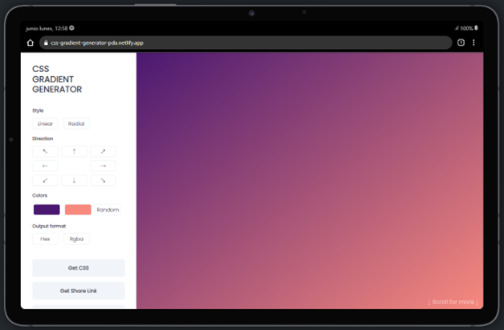

  

## Contents

* [1. Project description](#1-project-description)
* [2. Tech stack](#2-tech-stack)
* [3. Deployed project](#3-deployed-project)
* [4. Author](#4-author)

## 1. Project description

Website that allows you to create gradient backgrounds for all your web development needs! Developed with React, using this web app you can set the type, direction and colors for your gradient.

Already have a some colors in mind? Do you want to experiment with your own color combinations? Or do you need some suggestions? We got you covered! Select your favorite colors or let the applications randomize them for you, saving valuable time in your developing process.

With this website you can:

* Generate an url to share your favorite gradients. 
* Copy the CSS code ready to paste in your code.
* Save the gradients you like the most to share with the community. 

## 2. Tech stack

## 3. Deployed project

You can find the deployed project [here](https://css-gradient-generator-pda.netlify.app/).

## 4. Author

Developed by Perla Del Ángel © 2022.

 
